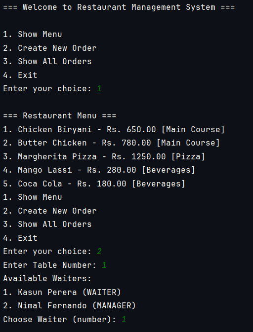
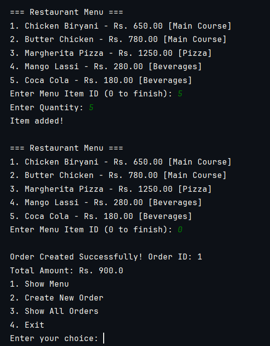

# 🍽️ Restaurant Management System - Pure Java OOP

A console-based **Restaurant Management System** built using **pure Java** to demonstrate strong **Object-Oriented Programming (OOP)** concepts.

---

## ✨ Project Highlights

- **No Frameworks** – Pure Java (No Spring Boot, No external libraries)
- Strong focus on **OOP Principles**
- Console-based interactive application

---

## 🧠 OOP Concepts Demonstrated

| OOP Concept       | Implementation |
|-------------------|--------------|
| **Inheritance**   | `Staff` extends `Person` |
| **Encapsulation** | Private fields with getters/setters |
| **Abstraction**   | Abstract `Person` class |
| **Polymorphism**  | Method overriding (`getRole()`) |
| **Composition**   | `Order` contains `List<OrderItem>` |
| **Single Responsibility** | Clean separation between Model, Service & Main |

---

## 📁 Project Structure
````
restaurant-oop/
├── model/
│   ├── Person.java
│   ├── Staff.java
│   ├── Category.java
│   ├── MenuItem.java
│   ├── Order.java
│   └── OrderItem.java
├── service/
│   └── RestaurantService.java
├── Main.java
````

## Sample Console Screenshot




